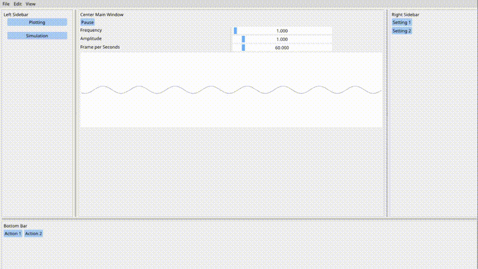
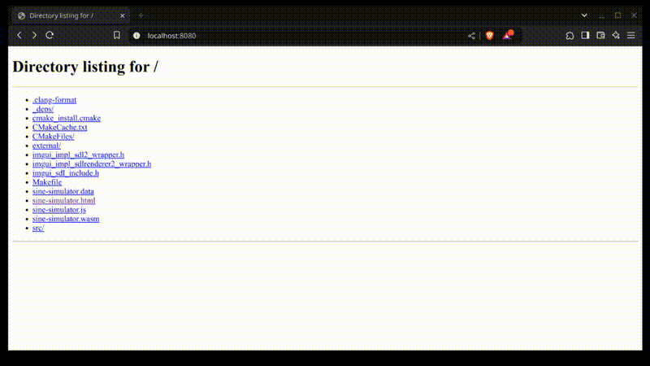

# Wave Simulator with ImGui and SDL2

Simple example to create a beautiful desktop GUI and web app using C++, ImGui, and SDL2.

<div align="center">
  <video controls>
    <source src="./docs/pro_desktop.mp4" type="video/mp4">
    <p>ImGUI Pro Design <a href="./docs/pro_desktop.mp4"></p>
  </video>
</div>

<p align="center">
  
  <br>
  <em>Preview of desktop app</em>
</p>

<p align="center">
  
  <br>
  <em>Preview of web app</em>
</p>

## Getting Started

### Arch Linux

Install basic development tools:
```
sudo pacman -S base-devel cmake sdl2 emscripten
```

### Ubuntu

```
sudo apt install -y build-essential cmake libsdl2-dev emscripten
```

## Build and run the application

For native desktop build :

```bash
chmod +x scripts/build_native.sh
./scripts/build_native.sh
./build/native/sine-simulator
```

For web build :

```bash
chmod +x scripts/build_web.sh
./scripts/build_web.sh
./scripts/run_webserver.sh
```
